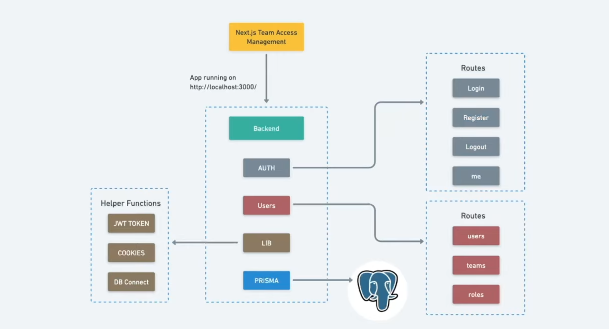

# Team Management Next.js Project

This project is a **team management application** for internal company use. Users have different roles and can manage teams and their members based on their permissions.




## Features

- User registration and login system (JWT-based)
- Role-based access control:
  - **ADMIN:** Can manage all users and roles
  - **MANAGER:** Can manage members of their own team
  - **USER:** Can view only their own profile
- Team management:
  - Create and view teams
  - Assign team members
  - Update user roles
- PostgreSQL database for data storage
- Prisma ORM for database interactions
- Built with Next.js 16 (App Router)
- TypeScript support

## Technologies Used

- **Next.js 16** – React-based frontend & backend framework
- **TypeScript** – Static typing for safety
- **Prisma** – Database ORM
- **PostgreSQL** – Relational database
- **bcryptjs** – Password hashing
- **jsonwebtoken (JWT)** – User authentication
- **TailwindCSS** – Styling library

## Setup Instructions

1. Clone the repository:
   ```bash
   git clone <repo-url>
   cd team-managment-nextjs-16

2. Install Dependencies:

  npm install

 3. Create a .env file:
 ```bash
 DATABASE_URL="postgresql://<user>:<password>@localhost:5432/team_managment_db"
JWT_SECRET="<your-secret-key>"
```
4. Push Prisma schema to the database and seed sample data:
 ```bash
 npx prisma db push
npm run db:seed
```
5. Start development server:
 ```bash
npm run dev
```
6. Open in your browser:
 ```bash
http://localhost:3000

```
## Important Files
- prisma/schema.prisma – Database schema and models
- prisma/seed.ts – Seed script for sample users and teams
- app/api/auth/login/route.ts – Login API endpoint
- app/api/auth/logout/route.ts – Logout API endpoint
- app/api/user/[userId]/team/route.ts – Team management API
- app/lib/auth.ts – Authentication, password hashing, JWT, and permission checks
- app/lib/db.ts – Prisma client and database connection

## Usage
1. Login:
- POST /api/auth/login
 ```bash
 {
  "email": "john@company.com",
  "password": "123456"
}

```
2. Logout:
- POST /api/auth/logout

3. Change user role(Admin Only):
- PATCH /api/user/:userId/team
 ```bash
{
  "role": "MANAGER"
}

```
## Notes
- All passwords are hashed with bcrypt.

- JWT token is stored in an HTTP-only cookie.

- Next.js App Router organizes all API routes under /app/api/...


     

